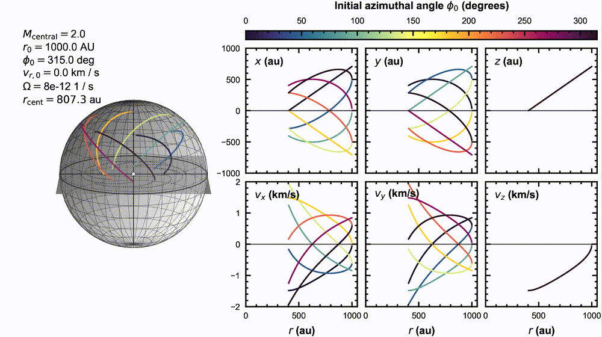

# PIMS (Pineda Implementation of the Mendoza Streamline model)

Generate a streamline to model particles in free-fall toward a central mass.

**History:** [Pineda et al. (2020)](https://ui.adsabs.harvard.edu/abs/2020NatAs...4.1158P/abstract) developed a numerical implementation of the [Mendoza et al. (2009)](https://ui.adsabs.harvard.edu/abs/2009MNRAS.393..579M/abstract) analytic accretion flow model to aid the discovery a streamer of 10,500 au length in Per-emb-2. 
It has since been used by many more works, e.g. [Valdivia-Mena et al. (2022)](https://ui.adsabs.harvard.edu/abs/2022A%26A...667A..12V/abstract), [Valdivia-Mena et al. (2023)](https://ui.adsabs.harvard.edu/abs/2023A%26A...677A..92V/abstract), [Valdivia-Mena et al. (2024)](https://ui.adsabs.harvard.edu/abs/2024A%26A...687A..71V/abstract), [Gieser et al. (2024)](https://ui.adsabs.harvard.edu/abs/2024A%26A...692A..55G/abstract), and others. This repository --PIMS-- is a re-packaging of the original implementation, presented by Speedie et al. (resubmitted). The main functions were sourced (around 01/2024) from [velocity_tools/stream_lines.py](https://github.com/jpinedaf/velocity_tools/blob/master/velocity_tools/stream_lines.py) ([Pineda et al. 2010](https://ui.adsabs.harvard.edu/abs/2010ApJ...712L.116P/abstract)).

## Example

Load the module:

```python 
from pims import streamline
```

Set the streamline parameters:

```python
mass        = 2.     # Msun
omega       = 8e-12  # Hz
r0          = 1000   # au
theta0      = 45     # deg
phi0        = 0      # deg
v_r0        = 0      # km/s
rmin        = 50     # au (optional)
delta_r     = 10     # au (optional)

# Optional: Parameters governing the projection onto the sky
inc         = 0      # deg
pa          = 0      # deg
dist        = 0      # pc
v_sys       = 0      # km/s
```

Generate a streamline: 

```python 
streamer = streamline(mass=mass, omega=omega, r0=r0, theta0=theta0, phi0=phi0, v_r0=v_r0, inc=inc, pa=pa, dist=dist, v_sys=v_sys)
```

And that's it! To see all the attributes/properties of the streamline:

```python 
print(streamer)
```

A variety of plotting functions are available. For example, you can view the streamline trajectory in the disk frame (``x``,``y``,``z``), or in the sky frame (``x_sky``, ``y_sky``, ``z_sky``):

```python 
streamer.plot_xyz_diskframe() # Native coordinates; xy plane is the sphere's equatorial plane
streamer.plot_xyz_skyframe() # Projected onto the sky; Like RA, Dec and LOS, but in au
```

Or, plot the streamer in RA-Dec coordinates on the sky, side-by-side with its trajectory in PV space (common figure in the literature; e.g. Figure 3 of Pineda et al. 2020; Figure 4 of Valdivia-Mena et al. 2022):

```python 
streamer.plot_model()
```

Here's a collection of streamlines with varying initial azimuthal angle, ``phi0``, to give a first visual taste of the model. The corresponding plotting function is ``streamer.plot_6panel_cartesian()``:



Further documentation and tutorials in ``docs/`` is work in progress.